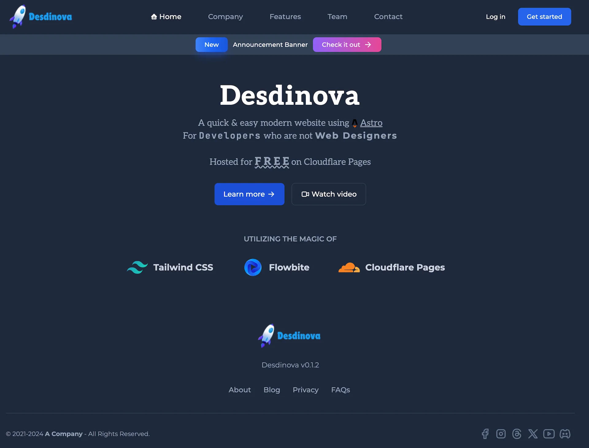
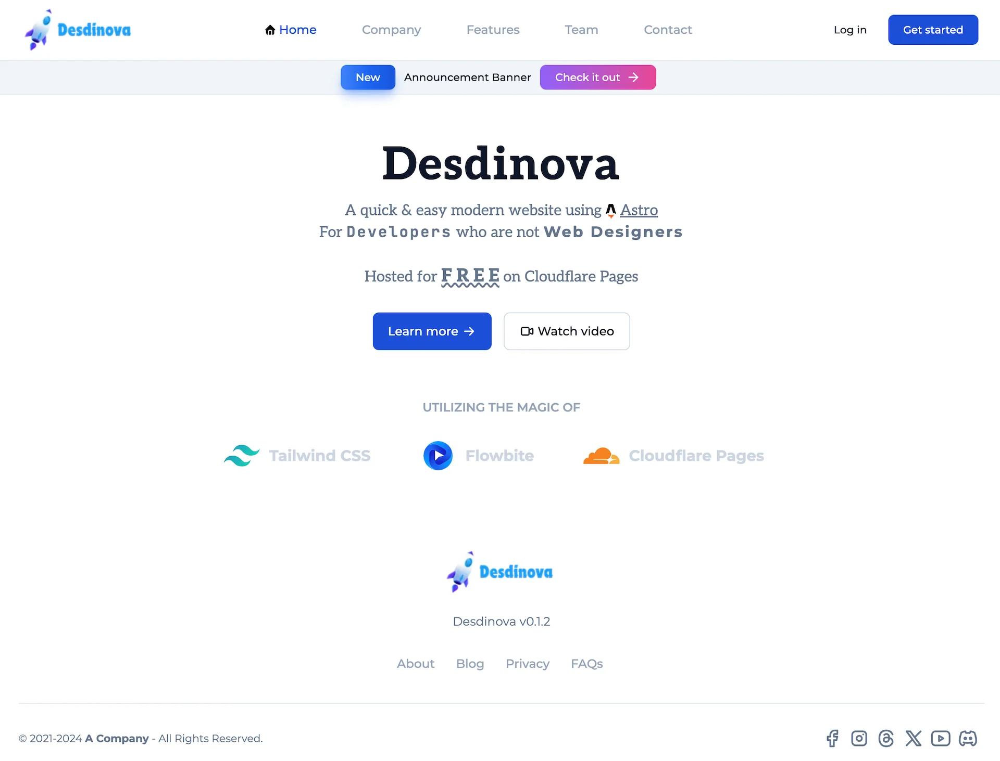

# Desdinova

#### A quick & easy Astro starter website for use with Tailwind, Flowbite and Cloudflare Pages for non-designers




## Objectives

-   Create a modern, clean, and simple website starter for non-designers
-   Enable rapid building and deployment of a basic Astro website
-   Pre-configured for Tailwind CSS, Flowbite, and Cloudflare Pages
-   Minimize reliance on external and third-party dependencies
-   Aim for a perfect Lighthouse score
-   Assist beginners with Astro and Cloudflare Pages
-   Completely F R E E!
-   Blazingly F A S T!

## Features

-   Automatic support for light and dark modes
-   Fully responsive design
-   Automatic generation of `robots.txt` and `sitemap.xml`
-   SEO optimization
-   Basic blog functionality
-   Includes some free Flowbite blocks pre-configured and optimized (highly recommended paying for access to all blocks!)
-   Video embedding (YouTube, Vimeo)
-   Icon integration via Iconify
-   View Transitions
-   Custom 404 page

## To-Do List

-   [x] retina images
-   [ ] Related blog posts
-   [ ] Pagination for blog posts
-   [ ] Blog post categories
-   [ ] Blog post tags
-   [ ] Blog post reading time
-   [ ] Mega menu
-   [ ] Improve UI of Search

## Future Ideas

-   Easier color palette customization

---

## Getting Started (Get Up & Running in 10 Minutes!)

### get environment setup

1. `mkdir astro-desdinova` (or your preferred project name)
2. `cd astro-desdinova`
3. `git clone http://github.com/montopolis/desdinova ./ && rm -fr ".git/"` (Mac)
4. Run `npm install` to install packages
5. Run `npm run dev` to start development

-   Open the site with the provided URL to verify it's working

### do basic configuration

1. Update `src/config/desdinova-config.ts` values under **UPDATE BELOW FIRST**
2. Update the Logo [see below](#updating-the-logo)
3. Update the Favicon [see below](#updating-the-favicon)
4. Update the Font (if necessary [see below](#updating-the-font))
5. Adjust Colors (if necessary [see below](#updating-colors))

### git & deploy

1. Commit all changes and push to Git
2. Set up Cloudflare Pages for testing [see below](#setting-up-cloudflare-pages-for-testing)
3. Done!

## Next Steps

1. Customize the Top Menu in `src/components/TopMenu.astro`
2. Customize the Bottom Menu in `src/components/BottomMenu.astro`
3. Add any required scripts to `src/components/Analytics.astro`
4. Update `src/pages/index.astro` as your homepage
5. Ideally, leave the `src/components/_core` folder untouched to facilitate future updates

## Adding a New Page (A Basic Flowbite Workflow)

1. Copy `src/pages/_starterPage.astro` to a new file within `src/pages`
2. Update `pageTitle` and `pageDescription` in `<Layout pageTitle="_starter" pageDescription="_starter Page">`
3. Find a Flowbite component or block at [Flowbite](https://flowbite.com) that you wish to use
4. Click "Copy Code" (CSS and JS are not needed)
5. Paste the code inside `<Layout></Layout>`
6. Customize the component/block
7. Review, edit, and refine until satisfied with your page
8. Add the new page to the Top or Bottom Menu, or link it elsewhere on the site
9. Repeat these steps for additional pages

---

## Setting Up Cloudflare Pages for Testing

1. Sign in or sign up at [Cloudflare Dashboard](https://dash.cloudflare.com)
2. Navigate to Workers & Pages
3. Click "Create"
4. Switch to the Pages tab
5. Select "Connect to Git"
6. Authorize connection to your Git repository
7. Choose your repository
8. Click "Begin Setup"
9. Set "Framework Preset" to "Astro"
10. Click "Save and Deploy"
11. Done!

## Setting Up Cloudflare Pages for Your Domain

1. Ensure your DNS is managed by Cloudflare
2. Complete the Cloudflare Pages setup for testing
3. Navigate to Workers & Pages
4. Select your site
5. Go to the "Custom Domains" tab
6. Click "Setup a custom domain"
7. Enter your domain name (e.g., www.mywebsite.com or mywebsite.com)
8. Click "Continue"
9. Activate the domain if all details are correct
10. Wait 5-60 minutes for DNS & SSL configuration
11. Done!
12. Note: To support both www and non-www access, consider setting up a custom Cloudflare Redirect
    Rule. [More info](https://community.cloudflare.com/t/redirect-the-www-to-non-www/558655)

---

## Updating the Logo

-   Replace `src/assets/images/logo-square.png` with your square logo
-   Replace `src/assets/images/logo.png` with your primary logo
-   For further customization, edit `src/components/SiteLogo.astro`

## Updating the Favicon

### Modern Way to Implement Favicon

Use [RealFaviconGenerator](https://realfavicongenerator.net/svg-favicon/)

-   Update `favicon.svg` and `favicon.png` in the `/public` folder
-   Note: Nothing else necessary for most browsers. Further customizations can be made in `src/components/Favicon.astro`

## Updating the Font

### Method #1: Bundled via Fontsource (recommended)

-   Add the font to `package.json` from [Fontsource](https://fontsource.org)
-   Import the font in `src/components/Fonts.astro`

### Method #2: Google Fonts (not recommended, but if you do enable Cloudflare Fonts)

-   Include the font in `src/components/Font.astro`

### For All Methods

-   Modify the font settings in `tailwind.config.mjs`

## Updating Colors

-   You can update the `primary` color palette in `tailwind.config.mjs`
-   You can get color palettes from https://uicolors.app/
-   You can also get color palettes from https://flowbite.com/blocks/marketing/header/#default-header-navigation

---

## Updating Astro

-   Stash any pending git updates to start with a clean slate
-   Run `npx @astrojs/upgrade` to upgrade Astro's first-party packages
-   Be mindful of potential breaking changes or proceed at your own risk
-   Optionally, run `npm run update` to update non-Astro packages
-   Ensure there are no errors with `npm run astro check`
-   Test the site using `npm run preview`
-   If everything is functional, commit and push the changes
-   Desdinova will be kept up-to-date with upstream updates as best as possible

## Porting Desdinova Updates to Your Site

-   This can be complex 😬
-   If your site is functional and building correctly, it's often best to leave it as is 😅

### Update Approaches

1. **Easy:** If your changes are limited to the `src/pages` folder, copy over other content, re-run `npm install`, and
   validate
2. **Tricky:** Apply specific updates from the Desdinova repository to your site as needed
3. **Full Reboot:** Set up a new Desdinova instance and refactor your existing site into it (this is my annual practice
   for my sites)
4. **Most Likely:** I'll update Astro, Tailwind, Flowbite, and third-party packages as necessary
   using [this approach](#updating-astro)

---

## Image Handling

-   Images placed in `src/assets/images` will be optimized by Astro if imported
-   Refer to [Astro Image Guide](https://docs.astro.build/en/guides/images/#where-to-store-images)
-   Alternatively, store images in the `/public` directory

## Announcement Banner

-   Customize the banner in `src/components/Announcement.astro`
-   To disable the banner, comment out `<Announcement />` in `src/pages/index.astro`

## Change Blog Posts Sort Order

-   see notes in `src/scripts/_desdinova-scripts.ts`

## Draft Blog Posts

Blog posts that are marked `draft=true` are not published to Production. Just add `draft=true` to the frontmatter/metadata at the top of the blog post.

## Scripts (e.g., Analytics)

-   Place required scripts in `src/components/Analytics.astro`

## Configuring Redirects

-   You can specify a mapping of permanent redirects in your Astro config with the redirects value. For most redirects, this is a mapping of an old route to the new route:
-   https://docs.astro.build/en/guides/routing/#configured-redirects

## Environment Support (Local/Staging/Production)

Set up a `BUILD_MODE` environment variable in Cloudflare Pages or locally (copy `.env.example` to `.env`) to
conditionally render code or scripts based on the environment.

This allows specific scripts or HTML to be included as needed per environment.

```javascript
{
    import.meta.env.BUILD_MODE === "production" && (
        <script>// add scripts here for production only</script>
    )
}
```

```javascript
{
    import.meta.env.BUILD_MODE === "production" && (
        <b>Or put HTML code which only renders for production</b>
    )
}
```

### Setting Up Environment Variables in Cloudflare Pages

1. Go to your Cloudflare Pages site
2. Click "Settings"
3. Select "Add variables" or "Edit Variables"
4. Add the variable "BUILD_MODE"
5. Set the value as needed
6. Done!

---

## Links to Dependencies

-   [Astro](https://docs.astro.build)
-   [Astro SEO](https://github.com/onwidget/astrolib/tree/main/packages/seo)
-   [Astro Sitemap](https://docs.astro.build/en/guides/integrations-guide/sitemap/)
-   [Astro Icon](https://github.com/natemoo-re/astro-icon#readme)
-   [Astro Embed](https://astro-embed.netlify.app/getting-started/)
-   [Astro Pagefind](https://github.com/shishkin/astro-pagefind)
-   [Playform Compress](https://github.com/PlayForm/Compress)
-   [Fontsource](https://fontsource.org/docs/getting-started/introduction)
-   [Tailwind](https://tailwindcss.com)
-   [Tailwind Typography](https://tailwindcss.com/docs/plugins#typography)
-   [Flowbite](https://flowbite.com/blocks/)
-   [Iconify](https://icon-sets.iconify.design/)
-   [Privacy Policy Template](https://github.com/ArthurGareginyan/privacy-policy-template)

---

## Desdinova (🗣️ des-de-nova)

Inspired by one of my favorite Blue Öyster Cult songs!

When I was in middle school, the original studio and live versions were frequently playing either on vinyl or cassette
tape. I was fortunate to attend several of their concerts during high school.

At 17, the 1988 re-release on the Imaginos album wowed me; it's a spectacular redo, and the entire album remains in
rotation for me.

```text
Call me Desdinova
Eternal light
These gravely digs of mine
Will surely prove a sight
```

---

## Huge Thanks To

1. The **Astro** team for their **AMAZING** work
2. The **Tailwind** team for their **AMAZING** work
3. The **Flowbite** team for their **AMAZING** work
4. The **Iconify** team for their **AMAZING** work
5. The **Cloudflare Pages** team for their **AMAZING** work

If this repo was helpful for your Astro journey, please give it a STAR!

Pull requests are welcomed!

Wishing you happiness, health, and security 🤗

Maintain,

Babul
